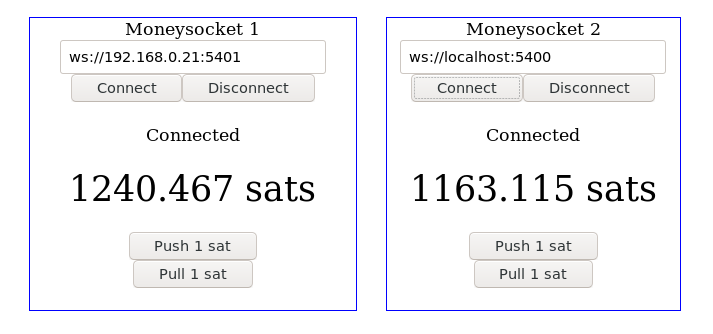

Moneysocket
===========

A very WIP proof-of-concept for a protocol for coordinating the requesting/paying of Lightning Network bolt11s over websockets. Carries an emphasis on low-latency and micropayment use cases.

Join [t.me/moneysocket](https://t.me/moneysocket) on Telegram as a gathering point for discussion.

WARNING - This code sucks and is just a threadbare happy-path working example. Error cases aren't handled. Balance limits aren't enforced. No auth has been implemented. No documentation to speak of.

There are no definitive answers here, but getting involved and having a say will help shape the outcome.

Overview/Demo
===========

[DEMO VIDEO](https://youtu.be/WuCzikX1u_c) - a 11 minute video explaining what is here and the thought process behind it.

What is provided here?
========================

Under `python/` there is a c-lightning plugin and a LND wrapper that serve websockets and accept connection. Under `browser/` there is a javascript client that runs in a browser to connect to the servers and utilize them for requesting bolt11 and instructing them to pay.

Is this better than LNURL?
===========
No. It is different for different use cases. Perhaps it is a good idea to combine any such websocket spec under the scope of [LNURL](https://github.com/btcontract/lnurl-rfc), but only if that makes sense to stakeholders.
